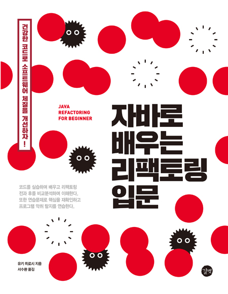

자바로 배우는 리팩토링 입문
====================

<a href="http://bit.ly/2h9frp1"></a>

## 소개
<자바로 배우는 리팩토링 입문>(도서출판 길벗, 2017)의 샘플 프로그램과 라이브러리가 포함되어 있습니다.


## 디렉터리 구조
디렉터리 구조는 다음과 같습니다.

```
리포지터리 루트
  + --- README.md 
  + --- ReplaceMagicNumberWithSymbolicConstant (1장) 
  | + --- before 
  | | + --- Main.java 
  | | + --- Robot.java 
  | | + - - MainTest.java 
  | + --- after 
  | | + --- Main.java 
  | | + --- Robot.java 
  | | + --- MainTest.java 
  | + --- ....
  + --- RemoveControlFlag (2장) 
  + --- IntroduceAssertion (3장) 
  + --- IntroduceNullObject (4장) 
  + --- ExtractMethod (5장) 
  + --- ExtractClass (6장) 
  + --- ReplaceTypeCodeWithClass (7장) 
  + --- ReplaceTypeCodeWithSubclasses (8장) 
  + --- ReplaceTypeCodeWithStateStrategy (9장) 
  + --- ReplaceErrorCodeWithException (10장) 
  + --- ReplaceConstructorWithFactoryMethod (11장) 
  + --- DuplicateObservedData (12장) 
  + --- ReplaceInheritanceWithDelegation (13장) 
  + --- HideDelegate (14장)
  + --- TeaseApartInheritance (15장) 
  + --- UnitTest (부록 B) 
  | + --- sample 
  | | + --- Person.java
  | | + --- PersonTest.java 
  | + --- failure 
  | + --- Person.java 
  | + --- PersonTest.java 
  + --- com 
     + --- hyuki 
        + --- refbook 
           + --- StandardOutputTest.java (각 장의 MainTest.java에서 사용) 
  + --- lib (JUnit 라이브러리)
  | + --- hamcrest-core-1.3.jar
  | + --- junit-4.12.jar
```


## 컴파일 및 실행 방법
독자의 이해를 돕기 위해 샘플 프로그램을 작동하는 클래스의 이름은 `Main`입니다(부록 B는 제외).
또한 `Main` 클래스를 담은 파일은 `Main.java`입니다.

명령줄에서 컴파일해 실행하려면 `Main.java`를 포함한 디렉터리에서 다음 명령을 실행합니다. 

```
javac Main.java 
java Main 
```

실행 결과는 책을 참조하세요.


## 테스트 방법 
JUnit으로 샘플 프로그램을 테스트하기 위한 클래스의 이름은 `MainTest`입니다(부록 B는 제외).
또한 `MainTest` 클래스를 담은 파일은 `MainTest.java`입니다. 

`StandardOutputTest`는 표준 출력에 나온 문자열을 테스트하는 클래스입니다. 
`StandardOutputTest` 클래스는 `src/com/hyuki/refbook/StandardOutputTest.java`에 있습니다. 

명령줄에서 테스트를 수행하려면 JUnit 4.12가 필요합니다.
JUnit 4.12 설치에 관한 내용은 책을 참조하세요.
여기서는 `junit-4.12.jar(C:\work\junit4.12\junit-4.12.jar)`를 예로 들어 설명합니다.

### Windows의 경우 
`MainTest.java`을 포함한 디렉터리에서 다음 명령을 실행합니다. 

```
javac -classpath ".;../..;C:/work/junit4.12/junit-4.12.jar" MainTest.java 
java -classpath ".;../..;C:/work/junit4.12/junit-4.12.jar;C:/work/junit4.12/hamcrest-core-1.3.jar" org.junit.runner.JUnitCore MainTest 
```

주의: 클래스 경로에 `../..`를 포함해야 합니다. 이는 `MainTest.java`에서 사용하는 `com.hyuki.refbook.StandardOutputTest` 클래스의 배치 장소입니다.

유닉스의 경우에는 위의 명령줄에서 세미콜론(`;`)을 콜론(`:`)으로 바꿉니다.


## 기타
파일 중 일부는 설명을 위해 컴파일 에러나 작동 에러가 있는 것도 있습니다. 
자세한 내용은 책을 참조하세요.

각 디렉터리의 `MainTest.java`에 포함되어 있는 테스트는 샘플로 포함된 것이며, 테스트에서 충분한 개수는 없습니다.


## 저작권 및 라이선스 
이 아카이브에 포함된 파일은 다음의 The zlib/libpng License에 따라 처리합니다.

Copyright (C) 2007 Hiroshi Yuki. 
http://www.hyuki.com/ref/ 
hyuki.mail@hyuki.com 

This software is provided 'as-is', without any express or implied warranty. 
In no event will the authors be held liable for any damages 
arising from the use of this software. 

Permission is granted to anyone to use this software for any purpose , 
including commercial applications, and to alter it and redistribute it freely, 
subject to the following restrictions : 

1. the origin of this software must not be misrepresented; you must not claim 
that you wrote the original software. If you use this software in a product, 
an acknowledgment in the product documentation would be appreciated but is not 
required. 

2. Altered source versions must be plainly marked as such, and must not be 
misrepresented as being the original software. 

3. This notice may not be removed or altered from any source distribution .


이 소프트웨어는 명시적 또는 암시적 보증 없이 '있는 그대로' 제공되며, 저자는 이 소프트웨어 사용으로 인해 발생하는 어떤 손해에 대해서도 책임을 지지 않습니다.

다음과 같은 제한 사항을 지키는 한 상업용 응용 프로그램을 비롯하여 어떤 목적으로든 이 소프트웨어를 사용하고 자유롭게 변경 및 재배포 할 수 있는 권한이 부여됩니다.

1. 이 소프트웨어의 출처를 허위 기술해서는 안 됩니다. 즉, 원본 소프트웨어를 작성했다고 주장해서는 안 됩니다. 이 소프트웨어를 제품에 사용하는 경우, 제품 문서에 감사 표시를 넣는다면 고맙겠지만 필수는 아닙니다.

2. 수정된 소스 버전은 그대로 표시되어야 하며 원본 소프트웨어로 오해하게 해서는 안 됩니다.

3. 이 주의 사항은 어떠한 소스 배포에서도 삭제하거나 변경될 수 없습니다.
